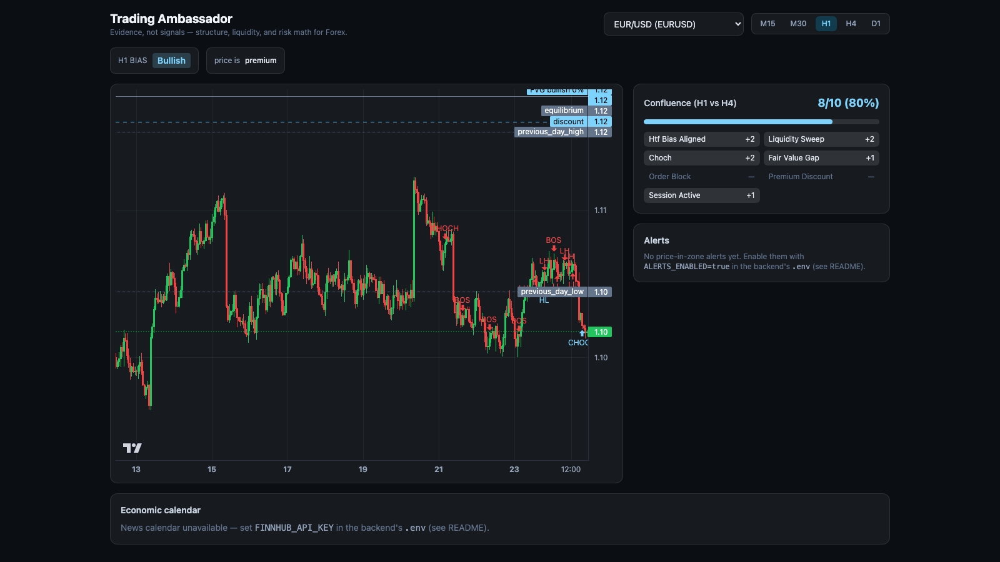

# Trading Ambassador

[](https://github.com/Lleyton20/Trading-Ambassador/actions/workflows/tests.yml)

A market intelligence and trading **analysis** platform for Forex and Deriv
synthetic indices (Volatility, Boom, and Crash indices), built around
Smart Money Concepts (SMC), session analysis, and risk management.

**Trading Ambassador presents evidence — it does not generate BUY/SELL
signals.** Every endpoint answers a question ("what is the market
structure?", "where is liquidity?", "is this setup's risk:reward
acceptable?") with data and reasoning, and leaves the trading decision to
the person using it.



*The React dashboard (`frontend/`) — bias-colored zones (bearish = red,
bullish = light blue), a live confluence score, an economic-calendar
panel, and price-in-zone alerts, all built on the API below.*

## Disclaimer

Trading Ambassador provides analytical and educational information. It
does not guarantee profitable trades. Trading involves financial risk.
Structure classifications, session analysis, and risk:reward figures are
mechanical calculations over historical/live price data — they are not
predictions, and historical behavior does not guarantee future results.

## Architecture

```
trading-ambassador/
├── backend/
│   ├── alembic/                  # schema migrations (see database.py for why)
│   ├── app/
│   │   ├── config.py            # ALL tunable parameters, one place (see file for why)
│   │   ├── instruments.py       # explicit per-symbol specs (pip size, contract size, ...)
│   │   ├── database.py          # SQLAlchemy engine/session (SQLite dev, Postgres-ready)
│   │   ├── persistence.py        # upserts computed SMC results into their DB tables
│   │   ├── models/              # DB tables: instruments, candles, swing_points,
│   │   │                        #   market_structure_events, order_blocks,
│   │   │                        #   fair_value_gaps, liquidity_levels/sweeps,
│   │   │                        #   sessions, daily_levels, alerts
│   │   ├── schemas/              # Pydantic request/response shapes for the API
│   │   ├── market_data/          # MarketDataProvider interface, a deterministic dev
│   │   │                        #   fixture, a live Deriv API provider, OHLC checks
│   │   ├── sessions/              # Asian/London/New York sessions, ODH/ODL, PDH/PDL
│   │   ├── smc/                  # swings, HH/HL/LH/LL, BOS/CHoCH, order blocks,
│   │   │                        #   fair value gaps, liquidity sweeps, premium/discount
│   │   ├── confluence/            # weighted confluence scoring across the above
│   │   ├── news/                  # Finnhub economic calendar client + engine
│   │   ├── alerts/                # price-in-zone watcher + Telegram notifier
│   │   ├── risk/                 # risk:reward calculator, position size calculator
│   │   └── api/                  # FastAPI routes tying the above together
│   ├── scripts/plot_analysis.py  # annotated-chart dev tool (see "Visualizing analysis")
│   ├── tests/                    # pytest, deterministic hand-verified fixtures
│   ├── requirements.txt
│   └── .env.example
├── frontend/                      # React + TypeScript + Vite dashboard
│   └── src/
│       ├── components/            # chart, bias badge, confluence/news/alerts panels
│       ├── api.ts                # typed fetch client for the backend
│       └── colors.ts             # bias color convention (bearish=red, bullish=light blue)
├── mt5/                           # MQL5 Expert Advisor - draws the same
│   │                              #   zones/bias natively on an MT5 chart
│   ├── Experts/TradingAmbassadorEA.mq5
│   └── Include/JAson.mqh          # vendored JSON lib (MQL5 has none built in)
└── README.md
```

Backtesting and the trade journal are **not built yet** — see "Roadmap"
below. This is intentional: the spec this project follows is explicit
that building everything at once produces an unreviewable mess. Each
phase ships as a working, tested slice.

## What's working right now (Milestones 1-4 + dashboard)

- **Market data layer**: a `MarketDataProvider` interface (spec-style
  vendor abstraction) with a deterministic synthetic-data provider for
  development, plus OHLC data-quality validation (missing/duplicate/
  out-of-order timestamps, invalid OHLC relationships, extreme price
  jumps).
- **Session engine**: Asian/London/New York session open/high/low/close,
  computed with real IANA timezones (`zoneinfo`) so daylight saving is
  handled correctly, not hard-coded as a fixed UTC offset.
- **Opening Day High/Low & Previous Day High/Low**: computed as a
  *running* value (never peeking at candles that haven't happened yet
  within the day) from an explicitly configurable trading-day timezone
  and rollover hour.
- **Market structure (SMC)**: validated swing-point detection, HH/HL/LH/LL
  labeling, and Break of Structure / Change of Character detection with
  an explicit, documented algorithmic definition for each (candle-close
  confirmation, not wick touches) — see `app/smc/structure.py`'s
  docstring for the reasoning.
- **Order blocks**: created only from a confirmed BOS/CHoCH whose
  confirming candle clears a displacement threshold (ATR-relative, so it
  scales sensibly between low-volatility Forex and spiky synthetic
  indices) — not from "the last opposite candle" indiscriminately.
  Tracks mitigation state and retest count.
- **Fair Value Gaps**: three-candle detection with a mitigation
  *percentage* (not just filled/unfilled), so a partially-filled gap is
  reported as such.
- **Liquidity**: equal-highs/equal-lows clustering with a percentage-of-
  price tolerance (never exact float equality), plus Previous Day
  High/Low as liquidity levels. Each level reports whether it's been
  swept — defined as a wick beyond the level followed by a candle
  closing back through it, not merely touching it.
- **Premium/Discount**: the active dealing range from the most recent
  confirmed swing high/low, with price classified as premium, discount,
  or equilibrium.
- **Risk:Reward & position sizing**: RR calculator with a configurable
  minimum-quality threshold, and a position-size calculator driven by
  each instrument's real contract size/lot rules instead of a guessed
  constant.
- **Live market data**: a `DerivMarketDataProvider` alongside the mock
  fixture, backed by Deriv's public WebSocket API — covers both Forex
  majors and the synthetic indices from one connection, no API token
  required. Switch to it with `MARKET_DATA_PROVIDER=deriv`; see
  `app/market_data/deriv_provider.py`.
- **Persistence**: swing points, structure events, order blocks, FVGs,
  and liquidity levels/sweeps are upserted into their DB tables as a side
  effect of the `/smc` and `/liquidity` endpoints (`app/persistence.py`)
  — every response is still computed fresh from live candles, the DB
  write is an audit trail for later milestones (backtesting, journal).
- **Confluence scoring**: combines HTF bias alignment, liquidity sweeps,
  CHoCH, FVGs, order blocks, premium/discount, and session timing into a
  single weighted score against the weights in `app/config.py`
  (`app/confluence/engine.py`) — still evidence, not a signal.
- **Schema migrations**: Alembic (`backend/alembic/`), reading
  `DATABASE_URL` from the same `Settings` object as the rest of the app.
- **Economic news calendar**: today's releases sorted high→low impact plus
  upcoming high-impact releases, via Finnhub (`app/news/`), mapped to the
  instruments they actually affect (USD news affects every USD pair +
  gold; Deriv's synthetic indices are deliberately never mapped to any
  news event — they're synthetic, not news-driven). Degrades to
  `available: false` rather than erroring if Finnhub isn't configured.
- **Price-in-zone alerts**: a background watcher (`app/alerts/`) checks
  every instrument's current price against unmitigated order
  blocks/FVGs and fires an alert — persisted to the DB and sent to
  Telegram — the first time price enters a zone it wasn't already
  sitting in. Off by default (`ALERTS_ENABLED=true` to turn on).
- **Dashboard** (`frontend/`): a React/TypeScript single-page app —
  candlestick chart with live SMC overlays, confluence score, the news
  calendar, and an alerts panel with a toast on new alerts. Polling-based
  (15–30s), not WebSocket-streamed — matches the SMC engine's own
  timeframe granularity, where nothing changes tick-by-tick.
- **REST API** (FastAPI) wiring all of the above into real endpoints —
  see below.
- **59 passing tests** against hand-verified, deterministic fixtures
  (not just "it ran without crashing").

## Key design decisions

- **No trade execution exists anywhere in this codebase.** The spec is
  explicit: this is an analysis and decision-support platform, not an
  auto-trading bot. Analysis and backtesting must be validated long
  before live execution is even considered.
- **Every module talks to a `MarketDataProvider` interface**, never a
  concrete broker client. A dev fixture (`mock_provider.py`) and a live
  Deriv API provider (`deriv_provider.py`) both implement it; switching
  between them is a one-line change in `app/main.py`, nothing in the
  session/SMC/risk code cares which one is active. Deriv was chosen over
  MetaTrader 5 because MT5's official Python package is Windows-only.
- **One `Settings` object holds every tunable parameter** (`app/config.py`)
  — nothing is hard-coded inside detection logic.
- **BOS and CHoCH have distinct, explicit definitions**: BOS is a candle
  close beyond the confirmed swing level *with* the prevailing bias;
  CHoCH is the same break *against* the prevailing bias. Both require a
  close (not a wick) and accept an optional minimum-displacement
  threshold.
- **Position sizing uses each instrument's real `contract_size`/`pip_size`**
  via an explicit `InstrumentProfile` registry — never a guessed constant.
- **Every DB write in `app/persistence.py` commits per-row, not per-batch.**
  The dashboard fires several endpoints in parallel on every page load, so
  two requests can both see a natural key as "not there yet" and both try
  to insert it — a harmless race. Committing one row at a time means a
  duplicate from that race only affects the one colliding row (caught,
  rolled back, skipped) instead of rolling back an entire batch of
  otherwise-legitimate new rows.

## Tech stack

- **Backend**: Python, FastAPI, Pydantic v2, SQLAlchemy 2.0, pandas, NumPy
- **Frontend**: React, TypeScript, Vite, Tailwind CSS,
  [lightweight-charts](https://github.com/tradingview/lightweight-charts)
- **Database**: SQLite for local development (zero setup); PostgreSQL-ready
  by changing one environment variable (`DATABASE_URL`)
- **External APIs**: Deriv (market data), Finnhub (economic calendar),
  Telegram Bot API (alerts) — all optional, the app runs with zero of them
  configured (mock data, no news, no alerts)
- **Testing**: pytest, deterministic fixtures (no reliance on live market
  data or manual eyeballing of charts)

## Installation

```bash
cd backend
python -m venv venv && source venv/bin/activate
pip install -r requirements.txt
cp .env.example .env   # optional — every setting has a safe default
alembic upgrade head    # creates the local SQLite schema

cd ../frontend
npm install
```

## Running the backend

```bash
cd backend
uvicorn app.main:app --reload
```

Then visit `http://127.0.0.1:8000/docs` for interactive API docs, or try:

```bash
curl http://127.0.0.1:8000/api/markets
curl "http://127.0.0.1:8000/api/markets/EURUSD/analysis"
curl "http://127.0.0.1:8000/api/markets/CRASH500/smc?timeframe=H1"
curl "http://127.0.0.1:8000/api/markets/EURUSD/liquidity?timeframe=H1"
curl "http://127.0.0.1:8000/api/markets/EURUSD/confluence?timeframe=H1"
```

To use live Deriv data instead of the mock fixture, set
`MARKET_DATA_PROVIDER=deriv` in `.env` (or the environment) before
starting the server — no API token needed, see "Data sources" below.

## Running the dashboard

With the backend running (above), in a second terminal:

```bash
cd frontend
npm run dev
```

Open `http://localhost:5173` — the Vite dev server proxies `/api/*` to
`http://127.0.0.1:8000` (see `frontend/vite.config.ts`), so no CORS setup
is needed in dev. Works immediately against the mock provider; the news
panel shows "unavailable" and the alerts panel shows "no alerts yet"
until you configure Finnhub / turn on alerts (see below).

### Economic calendar

Free API key from [finnhub.io](https://finnhub.io), then in `backend/.env`:

```
FINNHUB_API_KEY=your-key-here
```

Note: Finnhub's economic calendar endpoint has historically been gated
behind a paid plan for some accounts. If your key doesn't have access,
the panel just shows "unavailable" rather than erroring — the rest of
the dashboard is unaffected.

### Price-in-zone alerts + Telegram

1. Message [@BotFather](https://t.me/BotFather) on Telegram, `/newbot`, follow the prompts — you get a bot token.
2. Message your new bot once (anything), then visit
   `https://api.telegram.org/bot<your-token>/getUpdates` to find your chat ID.
3. In `backend/.env`:

```
ALERTS_ENABLED=true
TELEGRAM_BOT_TOKEN=your-bot-token
TELEGRAM_CHAT_ID=your-chat-id
```

Restart the backend — every 60 seconds (`ALERTS_POLL_INTERVAL_SECONDS`)
it checks every instrument's price against unmitigated order
blocks/FVGs and messages you the first time price enters one.

## MT5 Expert Advisor

MT5 has no way to embed a real web page inside the terminal, so the web
dashboard can't run *inside* MT5 — instead, `mt5/Experts/TradingAmbassadorEA.mq5`
polls the backend and draws the same zones/bias/confluence natively on an
MT5 chart, while the dashboard stays open separately for news and alerts.
**Display only** — it never places, modifies, or closes a trade.

1. Install MT5. On Mac, use the [official installer](https://www.metatrader5.com/en/download)
   (it's a Wine wrapper, not a VM — it shares your Mac's network stack, so
   `http://127.0.0.1:8000` reaches a backend running on the same machine
   with no extra networking setup). For the synthetic indices
   (V75, Boom/Crash), you need a **Deriv MT5** account specifically — a
   regular broker's MT5 server doesn't carry those symbols at all.
2. `backend/.env`: `MARKET_DATA_PROVIDER=deriv`, and keep the backend
   running continuously (`uvicorn app.main:app`) — the EA has nothing
   to poll otherwise.
3. In MT5: **Tools → Options → Expert Advisors** → check "Allow
   WebRequest for listed URL" → add `http://127.0.0.1:8000`.
4. Copy `mt5/Include/JAson.mqh` → `<data folder>/MQL5/Include/`, and
   `mt5/Experts/TradingAmbassadorEA.mq5` → `<data folder>/MQL5/Experts/`
   (find the data folder via **File → Open Data Folder** in MT5).
5. **MetaEditor** (F4) → open the EA → compile (F7). See
   `mt5/README.md` for the one spot most likely to need a fix on first
   compile (this file couldn't be tested against a real MQL5 compiler).
6. Drag the compiled EA onto a chart, enable **Auto Trading** (MT5 gates
   all EA execution behind this, even display-only ones like this one).
   Set the EA's `InpBackendSymbol` input if the chart's symbol name
   doesn't exactly match one of our instrument keys (EURUSD, GBPUSD,
   USDJPY, XAUUSD, CRASH500, CRASH1000, BOOM500, BOOM1000, V75) — Deriv
   MT5's exact synthetic-index symbol strings vary by account.

## Testing

```bash
cd backend
python -m pytest -v
```

## Visualizing analysis

Reading raw JSON to sanity-check whether a swing/BOS/order block/FVG
actually lines up with the chart is slow. `scripts/plot_analysis.py` runs
the exact same pipeline `app/api/routes.py` does and renders one annotated
candlestick chart as a static PNG — useful for a quick sanity check
without starting the dashboard at all:

```bash
cd backend
pip install -r requirements-dev.txt
python scripts/plot_analysis.py --symbol EURUSD --timeframe H1 --provider deriv
```

Saves a PNG under `scripts/output/` by default; pass `--show` to also open
an interactive window. Works with the mock fixture too (`--provider mock`,
the default) if you'd rather not hit live Deriv data.

## API endpoints

| Endpoint | Purpose |
|---|---|
| `GET /api/markets` | List known instruments with current price |
| `GET /api/markets/{symbol}/candles` | Historical candles for a timeframe |
| `GET /api/markets/{symbol}/daily-levels` | ODH/ODL, PDH/PDL, price status |
| `GET /api/markets/{symbol}/sessions` | Asian/London/NY session ranges |
| `GET /api/markets/{symbol}/smc` | Bias, BOS/CHoCH, order blocks, FVGs, premium/discount |
| `GET /api/markets/{symbol}/liquidity` | Equal highs/lows + PDH/PDL, each with sweep status |
| `GET /api/markets/{symbol}/confluence` | Weighted confluence score + per-factor breakdown |
| `GET /api/markets/{symbol}/analysis` | Combined dashboard "overview" payload |
| `GET /api/news/calendar` | Today's + upcoming high-impact economic releases |
| `GET /api/alerts/recent` | Recent price-in-zone alerts |
| `POST /api/risk/risk-reward` | RR calculation + quality classification |
| `POST /api/risk/position-size` | Position size from account/risk/instrument |

## Data sources

`app/market_data/mock_provider.py` is a deterministic **synthetic data
fixture** — clearly labeled as such in code, never used as a stand-in for
real market data claims, and still the default (`MARKET_DATA_PROVIDER=mock`)
so the project runs with zero setup. `app/market_data/deriv_provider.py`
is a live provider backed by Deriv's public WebSocket API: it covers both
Forex majors and Deriv's synthetic indices from one connection, and needs
no API token for market data (only a public `app_id`, defaulted to
Deriv's own demo id). Enable it with `MARKET_DATA_PROVIDER=deriv`.

## Roadmap

- **Milestone 5**: Backtesting engine (explicitly designed to reuse the
  same non-lookahead-safe functions already in `sessions/engine.py` and
  `smc/structure.py`).
- **Milestone 7**: Trade journal + performance analytics.

## Known gaps (intentional, tracked)

- Persisted SMC rows are an audit trail, not yet read back by anything —
  the API always computes its response fresh from live candles. Reading
  historical rows back is a natural fit for the backtester (Milestone 5).
- Raw candles aren't persisted yet, only the SMC results derived from
  them (`app/models/candle.py`'s table exists but nothing writes to it) —
  intentionally out of scope so far; revisit alongside Milestone 5.
- Session range detection assumes a session's local hours don't cross
  midnight (true for the three default sessions; documented in
  `sessions/engine.py`).
- The alert watcher's "already alerted" state is in-memory and per
  process — a restart forgets which zones were already active, so a zone
  price happens to still be sitting in when the app restarts will alert
  again once. Acceptable for a single-instance local deployment; would
  need moving that state into the DB for a multi-instance deployment.
- No authentication/users yet — single-user local development only.
- The MT5 EA (`mt5/`) hasn't been compiled or run — there's no MQL5
  toolchain available in the environment it was written in. It's built
  carefully against MetaQuotes' documented APIs, but MetaEditor's
  compiler is the first real check it gets; see `mt5/README.md` for the
  one spot most likely to need a fix.

## License

[MIT](LICENSE)
